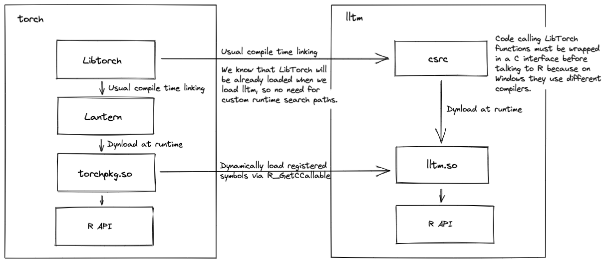
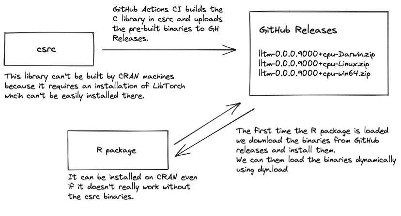

<!-- README.md is generated from README.Rmd. Please edit that file -->

# lltm

<!-- badges: start -->
<!-- badges: end -->

The goal of lltm is to be a minimal implementation of an extension for
[torch](https://github.com/mlverse/torch) that interfaces with the
underlying C++ interface, called LibTorch.

In this pakage we provide an implementation of a new recurrent unit that
is similar to a LSTM but it lacks a *forget gate* and uses an
*Exponential Linear Unit* (ELU) as its internal activation function.
Because this unit never forgets, we’ll call it LLTM, or
**Long-Long-Term-Memory unit**.

The example implemented here is a port of the official PyTorch
[tutorial](https://pytorch.org/tutorials/advanced/cpp_extension.html) on
custom C++ and CUDA extensions.

## High-Level overview

Writing C++ extensions for torch requires us to coordinate the
communication between multiple agents in the torch ecossytem. The
following diagram is a high-level overview on how they communicate in
this package.

On the torch package side the agents that appear are:

-   **LibTorch**: The PyTorch’s C++ interface. This is the library
    implementing all the heavy computations and the data structures like
    tensors.
-   **Lantern**: Is a C wrapper for LibTorch and is a part of the torch
    for R project. We had to develop Lantern because on Windows LibTorch
    can only be  
    compiled with the MSVC compiler while R is compiled with MinGW.
    Because of the different compilers, only C interfaces (not C++) are
    compatible.
-   **torchpkg.so**: This is how we are referring to the C++ library,
    implemented with Rcpp that allows the R API to make calls to Lantern
    functions. Another important feature it provides is custom Rcpp
    types that allows users to easily manage memory life time of objects
    returned by Lantern.

In the extension side the actors are:

-   **csrc**: What we are calling `csrc` here is the equivalent to
    Lantern in the torch project. It’s a C interface for calling
    functions from LibTorch that implement the desidered extension
    functionality. The library produced here must also be compiled with
    MSVC on Windows thus the C interface is required.
-   **lltm.so**: This is the C++ library implemented using Rcpp that
    allows the R API to call the `csrc` functionality. Here, in general,
    we want to use the `torchpkg.so` features to manage memory instead
    of re-implementing that functionality.

[](https://excalidraw.com/#json=6114208240369664,J9vJ8KK7VOBqgn7Nex5Huw)

## Project structure

-   **csrc**: The directory containing library that will call efficient
    LibTorch code. See the section `csrc` for details.
-   **src**: Rcpp code that interfaces the `csrc` library and exports
    functionality to the R API.
-   **R/package.R**: Definitions for correctly downloading pre-built
    binaries, and dynamically loading the `csrc` library as well as the
    C++ library.

### csrc: Implementing the operators and their C wrappers.

-   **CMakeLists.txt**: The first important file that you should get
    familiar with in this directory is the
    [CMakeLists.txt](https://github.com/mlverse/lltm/blob/main/csrc/CMakeLists.txt)
    file. This is the [CMake](https://cmake.org/) configuration file
    defining how the project must be compiled and its dependencies. You
    can refer to comments in the
    [file](https://github.com/mlverse/lltm/blob/main/csrc/CMakeLists.txt)
    for almost line by line explanation of definitions.

-   **csrc/src/lltm.cpp**: In this file we define the LibTorch
    implementation of the operations we want to export. We can use as
    many functions as we want in the implementation and we mark the
    functions we want to make available in the R package with
    `// [[torch::export]]`, similar to what we do when exporting
    functions with Rcpp. For example we define the `lltm_forward`
    implementation with: (For details on the `lltm_forward`
    implementation refer to the [official
    guide](https://pytorch.org/tutorials/advanced/cpp_extension.html).)

    The `// [[torch::export]]` marks will allow
    [torchexport](https://github.com/mlverse/torchexport) that is called
    during when building with cmake to autogenerate C wrappers necessary
    to handle errors and to correctly pass data between this library and
    the R package.

    ``` cpp
    // [[torch::export]]
    std::vector<at::Tensor> lltm_forward(
      torch::Tensor input,
      torch::Tensor weights,
      torch::Tensor bias,
      torch::Tensor old_h,
      torch::Tensor old_cell) {
        auto X = torch::cat({old_h, input}, /*dim=*/1);

        auto gate_weights = torch::addmm(bias, X, weights.transpose(0, 1));
        auto gates = gate_weights.chunk(3, /*dim=*/1);

        auto input_gate = torch::sigmoid(gates[0]);
        auto output_gate = torch::sigmoid(gates[1]);
        auto candidate_cell = torch::elu(gates[2], /*alpha=*/1.0);

        auto new_cell = old_cell + candidate_cell * input_gate;
        auto new_h = torch::tanh(new_cell) * output_gate;

        return {new_h,
                new_cell,
                input_gate,
                output_gate,
                candidate_cell,
                X,
                gate_weights};
    }
    ```

-   **csrc/src/exports.cpp**: This file is autogenerated by
    `torchexport` and should not be modified manually. It wrapps the
    function that uses LibTorch’s API into C API functions that can be
    called in the R/Rcpp side.

-   **csrc/include/lltm/exports.h** This file includes declarations used
    by functions defined in `exports.cpp`. It should always be included
    in `lltm.h`. Note that this file is also autogenerated.

-   **csrc/src/lltm.def**: This file is automaticaly generated by a
    custom CMake command. It lists the functions from `lltm.cpp` that we
    want to export. This is only required for Windows, but it’s a good
    practice to keep it up to date. See more information on Module
    definition files in this
    [link](https://docs.microsoft.com/en-us/cpp/build/reference/module-definition-dot-def-files?view=msvc-160)

    For example, the current definition is:

        LIBRARY LLTM
        EXPORTS
          _lltm_forward
          _lltm_backward

-   **csrc/include/lltm/lltm.h**: In a minimal setup this file only
    needs to include the `lltm/exports.h` headers that is auto-generated
    by [`torchexport`](https:://github.com/mlverse/torchexport). You
    might want add other function declarations here, if for some reason
    you had to bypass the code autogeneration.

The library implemented in `csrc` can be compiled with CMake. We use the
following commands to compile and install it locally:

    cd csrc && mkdir build
    cmake .. && cmake --build . --target install --config Release

### src: Wrapping the library with Rcpp

Now that we implemented the operators that we wanted to call from R, we
can now implement the Rcpp wrappers that will allow us to call those
operators from R.

-   **src/exports.cpp**: This file is autogenerated and defines Rcpp
    wrappers for the functions that have been marked with
    `[[torch::export]]` in your library. The wrappers defined in this
    file take R objects and convert them to the correct C type that we
    need to pass to the C library. Remember that the C library return
    `void*` pointers and we need to make sure to free this objects when
    they are no longer in use, otherwise we will leak memory. The
    `torch.h` headers provides Rcpp extension types that act like *smart
    pointers* and make sure that the objects created in the C library
    are correctly freed when they are no longer in use. The types
    implemented in `torch.h` also implement convertion from and to
    `SEXP`s so we don’t need to implement them on our own.

    You can find all the available types in the `torch` namespace
    available when you include `<torch.h>`.

-   **src/lltm.cpp**: In a minimal setup this file only needs to include
    the header files from the torch package as well as from your library
    and specify a few variables that make sure the implementations are
    included. It also must define a `host_exception_handler` that is
    used to correctly raise exceptions from your C library to the R
    runtime - in general you don’t need to modify the one that’s already
    defined in this template.

    ``` cpp
    #include <Rcpp.h>
    #define LLTM_HEADERS_ONLY // should only be defined in a single file
    #include <lltm/lltm.h>
    #define TORCH_IMPL // should only be defined in a single file
    #define IMPORT_TORCH // should only be defined in a single file
    #include <torch.h>
    ```

-   **src/Makevars.win**: On Windows, the normal compilation workflow
    wouldn’t work as Windows wouldn’t be able to find the
    implementations of `_lltm_forward` (as it only sees the headers), so
    we convert the `.def` file created in `csrc` to a `.lib` file and
    use this as an argument to the linker. That’s what `Makevars.win`
    implements. In most cases you won’t need to modify this file.

### R API

Now the Rcpp wrappers are implemented and exported you have now access
to `lltm_forward` in the R side.

-   **R/lltm.R**: In this package we wanted to provide a new autograd
    function and a `nn_module` that uses it and we implemented it in
    this file. This is normal R code and we won’t discuss the actual
    implementation.

## Packaging

It’s not trivial to package torch extensions because they can’t be
entirely built on CRAN machines. We would need to include pre-built
binaries in the package tarball but for security reasons that’s not
accepted on CRAN.

In this package we implement a suggested way of packaging torch
extensions that makes it really easy for users to install your package
without having to use custom installation steps or building libraries
from source. The diagram below shows an overview of the packaging
process.



-   **R/package.R**: implements the suggested installation logic -
    including downloading from GitHub Releases and dynamically loading
    the shared libraries.

-   **.github/workflows/R-CMD-check.yaml**: the job called *Build-Libs*
    implements the logic for building the binaries from `csrc` for each
    operating system and uploading to GH Releases.

## Installation

~~You can install the released version of lltm from
[CRAN](https://CRAN.R-project.org) with:~~

``` r
install.packages("lltm")
```

And the development version from [GitHub](https://github.com/) with:

``` r
# install.packages("devtools")
devtools::install_github("mlverse/lltm")
```
